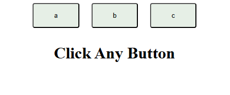

# Sound Button Website

This is a simple website built with HTML, CSS, and JavaScript, where each button plays a unique sound when clicked. It’s designed for an engaging interactive experience.

## Features

- **Multiple Sound Buttons**: Each button plays a specific sound upon clicking.
- **Responsive Design**: Adapted for mobile and desktop views.
- **JavaScript Audio Control**: JavaScript is used to handle the audio functionality for each button.

## Technologies Used

- **HTML**: Structure of the website and button layout.
- **CSS**: Styling for buttons and layout.
- **JavaScript**: Handles sound playback for each button.

